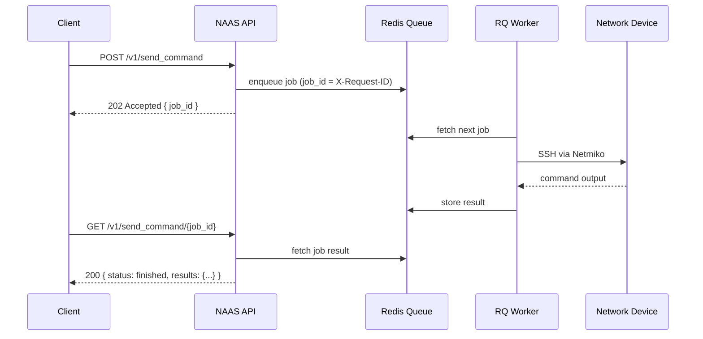
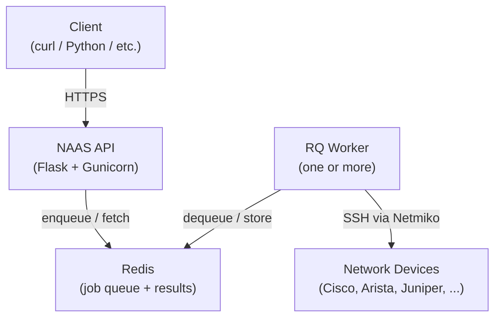
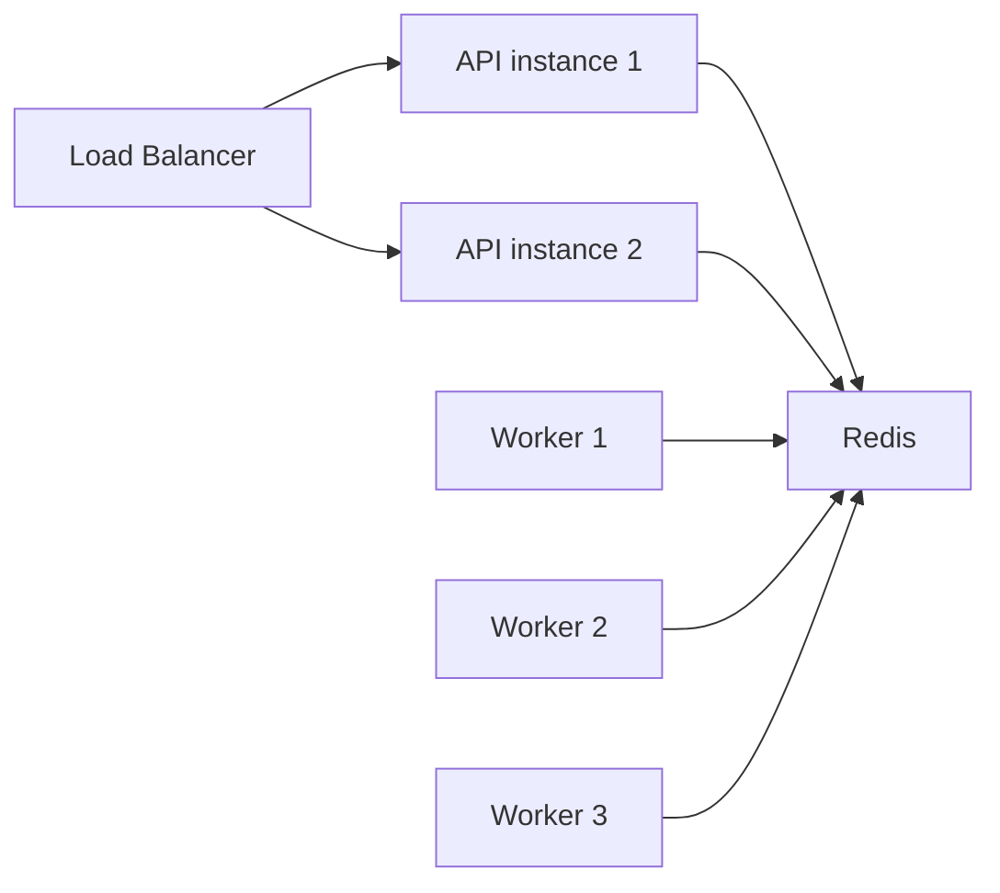

# Architecture

## Overview

NAAS is a thin async wrapper around [Netmiko](https://github.com/ktbyers/netmiko). The API accepts requests, enqueues jobs, and returns immediately. Workers pick up jobs from the queue and execute them against network devices.

## Components

### NAAS API

The Flask application handles authentication, request validation, job enqueueing, and result retrieval. It is stateless — all state lives in Redis. Multiple API instances can run behind a load balancer.

### Redis

Redis serves two roles:

- **Job queue** — RQ uses Redis sorted sets to hold pending jobs
- **Result store** — completed job output is stored in Redis with a configurable TTL

### RQ Worker

Workers are separate processes that dequeue jobs and execute them. Each worker handles one job at a time. Scale horizontally by running more worker containers.

Workers also hold circuit breaker state in Redis, so all workers share the same per-device failure counts.

### Network Devices

NAAS connects to devices over SSH using Netmiko. The API credentials (HTTP Basic Auth) are passed directly to the device — NAAS does not maintain its own credential store.

## Request Lifecycle

1. **Client** sends `POST /v1/send_command` with device IP, platform, and commands
2. **API** validates the request (IP format, platform, auth), checks for duplicate job IDs and device lockout, then enqueues the job
3. **API** returns `202 Accepted` with the `job_id` (= `X-Request-ID`)
4. **Worker** picks up the job, checks the circuit breaker, connects to the device via SSH, runs the commands, and stores the result
5. **Client** polls `GET /v1/send_command/{job_id}` until `status` is `finished` or `failed`

## Why Async?

SSH connections to network devices can take seconds to minutes depending on device responsiveness, command complexity, and network latency. A synchronous API would hold HTTP connections open for the duration, limiting throughput and causing timeouts.

The async model lets the API return immediately and lets clients poll at their own pace. It also enables horizontal scaling — add more workers to increase throughput without changing the API layer.

## Scaling

- **API** scales horizontally — stateless, any instance can handle any request
- **Workers** scale horizontally — add containers with `docker compose up -d --scale worker=N`
- **Redis** is the single coordination point — use Redis Sentinel or Cluster for HA
