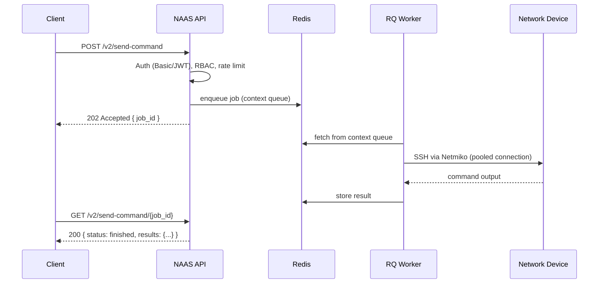
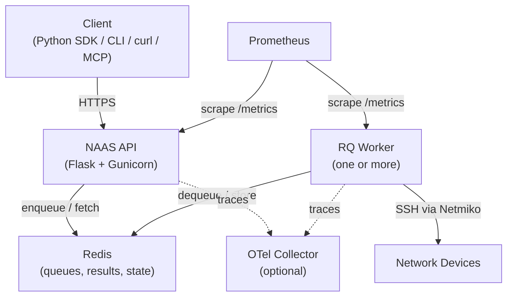
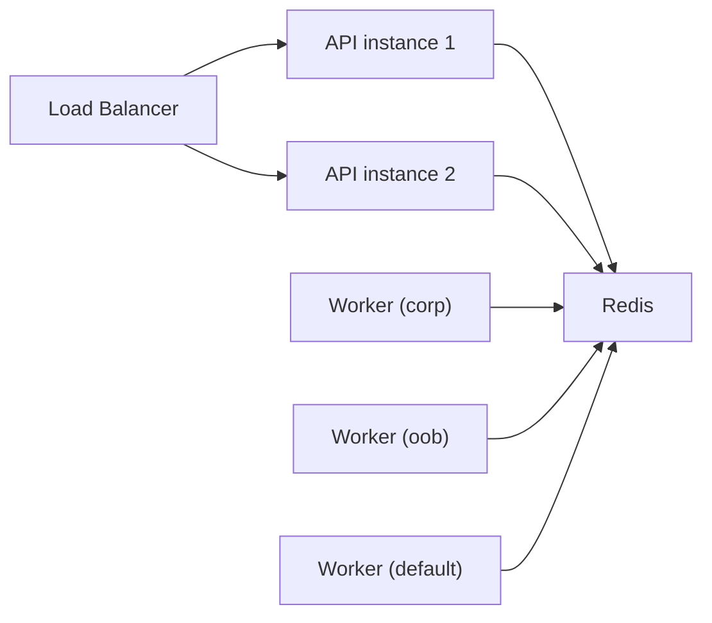

# Architecture

## Overview

NAAS is an async wrapper around [Netmiko](https://github.com/ktbyers/netmiko). The API accepts requests, enqueues jobs, and returns immediately. Workers pick up jobs from the queue and execute them against network devices over SSH.


```mermaid
sequenceDiagram
    participant Client
    participant API as NAAS API
    participant Queue as Redis
    participant Worker as RQ Worker
    participant Device as Network Device

    Client->>API: POST /v2/send-command
    API->>API: Auth (Basic/JWT), RBAC, rate limit
    API->>Queue: enqueue job (context queue)
    API-->>Client: 202 Accepted { job_id }

    Worker->>Queue: fetch from context queue
    Worker->>Device: SSH via Netmiko (pooled connection)
    Device-->>Worker: command output
    Worker->>Queue: store result

    Client->>API: GET /v2/send-command/{job_id}
    API-->>Client: 200 { status: finished, results: {...} }
```

Clients can also subscribe to `GET /v2/send-command/{job_id}/stream` for real-time SSE updates instead of polling.

## Components


```mermaid
graph TD
    Client["Client<br/>(Python SDK / CLI / curl / MCP)"]
    API["NAAS API<br/>(Flask + Gunicorn)"]
    Redis["Redis<br/>(queues, results, state)"]
    Worker["RQ Worker<br/>(one or more)"]
    Device["Network Devices"]
    Metrics["Prometheus"]
    OTel["OTel Collector<br/>(optional)"]

    Client -->|HTTPS| API
    API -->|enqueue / fetch| Redis
    Worker -->|dequeue / store| Redis
    Worker -->|SSH via Netmiko| Device
    Metrics -->|scrape /metrics| API
    Metrics -->|scrape /metrics| Worker
    API -.->|traces| OTel
    Worker -.->|traces| OTel
```

### NAAS API

Flask application handling:

- Authentication (HTTP Basic Auth or JWT Bearer tokens)
- RBAC enforcement (admin/operator/viewer)
- Rate limiting (per-caller and per-caller-per-device)
- Request validation and job deduplication
- Context-based queue routing
- Job enqueueing and result retrieval
- SSE streaming for real-time job updates
- Prometheus metrics at `/metrics`
- Structured audit event emission

Stateless — all state lives in Redis. Run multiple instances behind a load balancer.

### Redis

Redis is the central coordination point. It stores:

- **Job queues** — One RQ queue per context (`naas-default`, `naas-corp`, `naas-oob-dc1`, etc.)
- **Job results** — Completed output with configurable TTL
- **Circuit breaker state** — Per-device failure counts, shared across workers
- **Connection pool metadata** — Tracks pooled SSH connections per worker
- **Rate limit counters** — Sliding window sorted sets per caller
- **API keys** — JWT key metadata and revocation set
- **Encrypted credentials** — Device credentials encrypted at rest (when stored for pooled connections)
- **Idempotency keys** — Deduplication state for repeated submissions

For production, use a managed Redis with replication and persistence. The bundled Redis is single-replica with no persistence.

### RQ Workers

Workers are separate processes that dequeue jobs and execute them. Each worker process handles one job at a time.

- Serve one or more contexts (configured via `WORKER_CONTEXTS`)
- Maintain persistent SSH connection pool (reuse connections across sequential jobs to the same device)
- Share circuit breaker state across all workers via Redis
- Emit Prometheus metrics and structured audit events
- Propagate OpenTelemetry trace context from the API through the queue

Scale horizontally: total job concurrency = number of worker processes across all pods.

### Network Devices

NAAS connects to devices over SSH using Netmiko. Credentials from the HTTP request (Basic Auth) are passed directly to the device — NAAS does not maintain a separate credential store.

### MCP Server (Optional)

The `mcp-server-naas` package exposes NAAS operations to AI assistants via the Model Context Protocol. It's a thin client that calls the REST API — no direct Redis or device access.

## Request Lifecycle

1. **Client** sends `POST /v2/send-command` with host, platform, commands, and optional context
2. **API** authenticates (Basic Auth or JWT), checks RBAC role, enforces rate limits
3. **API** validates the request, checks idempotency key and device lockout
4. **API** enqueues the job to the context-specific queue (e.g. `naas-oob-dc1`)
5. **API** returns `202 Accepted` with `job_id`
6. **Worker** serving that context picks up the job, checks the circuit breaker
7. **Worker** connects to the device (reusing a pooled connection if available), runs commands, stores the result
8. **Client** retrieves results via `GET /v2/send-command/{job_id}` or SSE stream

## Why Async?

SSH connections to network devices take seconds to minutes depending on device responsiveness and command complexity. A synchronous API would hold HTTP connections open for the duration, limiting throughput and causing timeouts.

The async model lets the API return immediately. Clients poll or subscribe to SSE at their own pace. It also enables horizontal scaling — add workers to increase throughput without changing the API layer.

## Scaling


```mermaid
graph LR
    LB["Load Balancer"]
    API1["API instance 1"]
    API2["API instance 2"]
    Redis["Redis"]
    W1["Worker (corp)"]
    W2["Worker (oob)"]
    W3["Worker (default)"]

    LB --> API1
    LB --> API2
    API1 --> Redis
    API2 --> Redis
    W1 --> Redis
    W2 --> Redis
    W3 --> Redis
```

- **API** — Stateless, scales horizontally. Any instance handles any request.
- **Workers** — Scale per context. Each worker serves one or more contexts. Add replicas to increase concurrency for a given context.
- **Redis** — Single coordination point. Use Redis Sentinel or Cluster for HA.

=== "Docker Compose"

    ```bash
    docker compose up -d --scale worker=N
    ```

=== "Kubernetes (Helm)"

    ```bash
    helm upgrade naas charts/naas --set worker.replicas=N --set api.replicas=M
    ```
